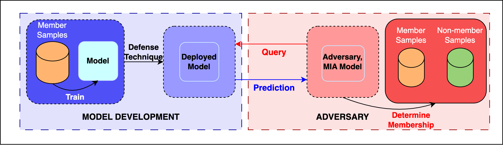

SynthShield: Leveraging Synthetic Distributions to Enhance Privacy Against Membership Inference
-----------------------------------------------------------------------------------------------

This repository accompanies the paper "SynthShield: Leveraging Synthetic Distributions to Enhance Privacy Against Membership Inference" currently under review at the International Conference on Pattern Recognition (ICPR). It contains the main code used in applying and analysing the SynthShield technique analysed in the paper. Our code is based on [Membership Inference Attacks and Defenses in Neural Network Pruning](https://github.com/Machine-Learning-Security-Lab/mia_prune). Testing was done on Ubuntu 20.04.6 LTS with Python 3.10.9. 



# Background

The growing application of machine learning on Personally Identifiable Information (PII) raises various privacy concerns. Techniques known as Membership Inference Attacks (MIAs) can be used to extract information from a trained model regarding its dataset. Previous research has shown that common pruning techniques increase model vulnerability to such attacks. Existing defenses to solve this include regularisation-based approaches, transfer learning, and perturbation-based approaches, among others. In this paper, we provide the first in-depth analysis of the effect of fine-tuning on a synthetic dataset generated to mimic the original distribution on MIA attack accuracy. We further show its effectiveness in defending against various black-box SOTA membership inference attacks.

# Installation

Clone the repo

```bash
git clone https://github.com/lycogno/mia-icpr
cd mia-icpr
```

Install packages (Python)

```bash
pip install -r requirements.txt
```

Make directories for outputs

```bash
mkdir saved_models_afterprune
mkdir shadow_models_afterprune
```

**NOTE:** The repo expects to find CIFAR10 data in *cifardata/* and generated data in *data/*.

# Commands

Generate victim models with our proposed defense

```bash
python prune.py --classifier mobilenet_v2
```

Generate shadow models

```bash
python prune_only_forshadow.py --classifier mobilenet_v2
```

Run the ablation

```bash
python mia_ours_ablation.py 0 config/cifar10_resnet18.json --attacks samia,nn,nn_top3 --classifier mobilenet_v2
```
